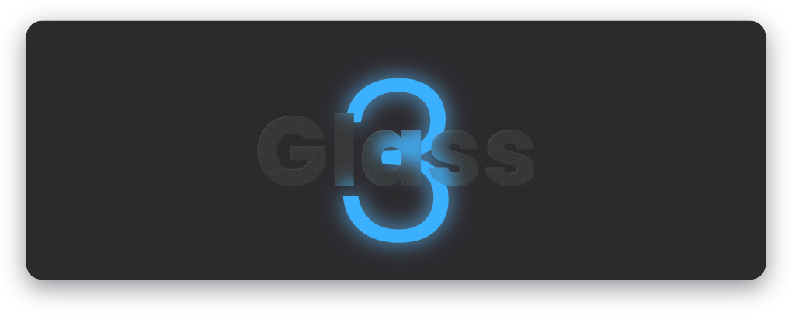

# Glass³
An operating system mockup right in your browser.

### Credits
This project is heavily inspired by Kurisubrooks' [Glass2](https://github.com/kurisubrooks/glass2/) and one of my own older projects [turbodeck](https://github.com/voxain/turbodeck). Be sure to check out Glass2, as it gave me the inspiration to start working on a project of this type again. :)

### Planned features
* Customizable desktop
* Multiple users
* App Store
* Open App system for third-party apps
* File System with Explorer

### Run
* You will have to have a local web server running that serves the root directory of this repo. Open `launcher.html` to "boot" into Glass³.

### Contribute
All contributions to this project are welcome! I'm always looking for ways to improve the code or add new features. Open a pull request :)